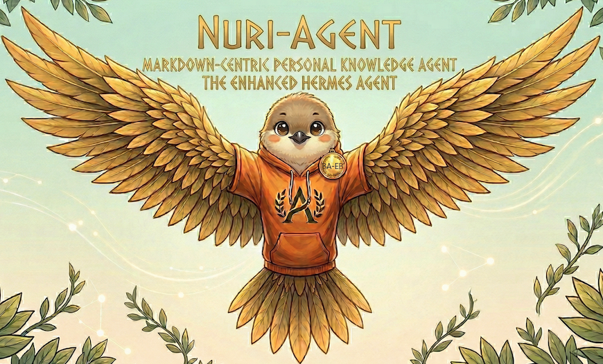
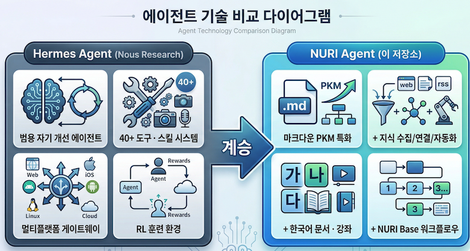
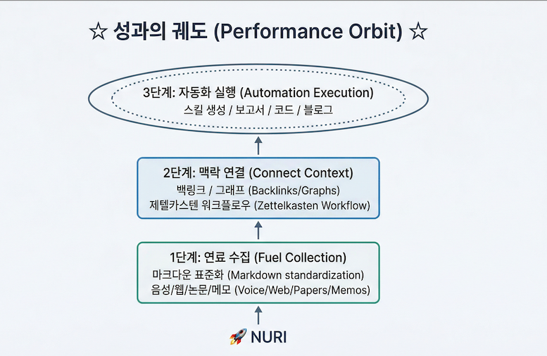

<p align="center">
  
</p>

<h1 align="center">NURI AGENT (누리 에이전트)</h1>
<p align="center"><b>마크다운 지능으로 당신의 업무를 궤도에 올리는 한국형 자율 워크 에이전트</b></p>
<p align="center"><i>From Notes to Orbit. 마크다운으로 시작하고, 성과로 완성됩니다.</i></p>

<p align="center">
  <a href="https://hermes-agent.nousresearch.com/docs/"></a>
  <a href="https://discord.gg/NousResearch"></a>
  <a href="https://github.com/NousResearch/hermes-agent/blob/main/LICENSE"></a>
  <a href="https://nousresearch.com"></a>
</p>

---

### Hermes Agent를 계승하는 자율형 PKM 에이전트

NURI Agent는 [Nous Research](https://nousresearch.com)의 **[Hermes Agent](https://github.com/NousResearch/hermes-agent)** 를 계승합니다. Hermes가 구축한 자기 개선 루프 — 스킬 자동 생성, 메모리 영속화, 세션 간 학습, 서브에이전트 위임 — 이라는 강력한 기반 위에, **마크다운 중심의 개인지식관리(PKM)** 라는 명확한 목적을 더합니다.

Hermes Agent가 "무엇이든 할 수 있는 범용 에이전트"라면, NURI Agent는 "마크다운으로 사고하는 지식 노동자를 위한 전용 에이전트"입니다.

<p align="left">
  
</p>

### 확장 전략: 원본은 건드리지 않는다

NURI Agent는 Hermes Agent의 원본 코드를 직접 수정하지 않습니다. 대신 **플러그인/확장 모듈 방식**으로 기능을 확장하여, 원본과의 지속적인 동기화를 보장합니다.

> **"원본"의 범위:** 여기서 원본이란 **마크다운(`.md`) 파일을 제외한 모든 파일** — Python 소스코드(`.py`), 설정 파일(`.yaml`, `.json`), 셸 스크립트(`.sh`), Docker 파일, JavaScript 등 — 을 의미합니다. 마크다운 문서는 한국어 번역 · NURI 브랜딩 · ko-guide 강좌 등 이 저장소의 핵심 부가가치이므로 자유롭게 수정합니다.

```
hermes-agent/                          ← 원본 코어 (수정하지 않음)
├── run_agent.py                       ← upstream 그대로 유지
├── model_tools.py                     ← upstream 그대로 유지
├── tools/                             ← upstream 그대로 유지
├── skills/                            ← upstream 그대로 유지
│
├── nuri-extensions/                   ← NURI 확장 모듈 (이 저장소에서 추가)
│   ├── skills/                        ← PKM 특화 스킬
│   │   ├── note-capture/SKILL.md      ←   노트 캡처 자동화
│   │   ├── backlink-manager/SKILL.md  ←   백링크/MOC 관리
│   │   ├── weekly-review/SKILL.md     ←   주간 지식 리뷰
│   │   └── zettelkasten/SKILL.md      ←   제텔카스텐 워크플로우
│   ├── tools/                         ← PKM 전용 도구 (registry.register 방식)
│   └── config/                        ← NURI 기본 설정 프리셋
│
├── ko-guide/                          ← 한국어 심층 강좌 (원본에 영향 없음)
└── *_en.md                            ← 영문 원본 보존
```

**이 전략의 이점:**

| 원칙 | 설명 |
|------|------|
| **Upstream 동기화** | `git pull upstream main`으로 Hermes Agent의 최신 업데이트를 충돌 없이 반영 |
| **원본 무결성** | Hermes 코어 파일을 수정하지 않으므로, 원본의 버그 수정 · 보안 패치가 그대로 적용됨 |
| **플러그인 격리** | NURI 확장 스킬/도구는 `nuri-extensions/`에 격리되어, 제거하면 원본 Hermes로 즉시 복원 |
| **Hermes 호환** | Hermes의 스킬 시스템(`skills/`)과 도구 레지스트리(`registry.register()`)를 그대로 활용하여 확장 — 별도의 플러그인 프레임워크를 만들지 않음 |

즉, NURI Agent는 Hermes Agent 위에 **탈부착 가능한 PKM 레이어**를 올린 것입니다. 원본을 fork하고 독자적으로 수정하는 방식이 아니라, 원본을 존중하면서 그 위에 확장하는 방식으로 장기적 유지보수를 보장합니다.

---

## nuri-extensions — PKM 확장 모듈

`nuri-extensions/`는 NURI Agent의 핵심 부가가치입니다. Hermes의 스킬 시스템과 도구 레지스트리를 그대로 활용하여, 원본 코드 수정 없이 PKM 기능을 추가합니다.

**[nuri-extensions/ 상세 문서 →](nuri-extensions/README.md)**

### PKM 스킬 (5종)

| 스킬 | 설명 | 주요 기능 |
|------|------|----------|
| **[note-capture](nuri-extensions/skills/note-capture/SKILL.md)** | 노트 캡처 자동화 | URL/텍스트/음성 → 구조화된 마크다운 노트 생성, 프론트매터 자동 부여, 태그 자동 할당 |
| **[backlink-manager](nuri-extensions/skills/backlink-manager/SKILL.md)** | 백링크/MOC 관리 | 링크 스캔, 백링크 분석, MOC 자동 생성, 고아 노트 탐지, 깨진 링크 검사 |
| **[weekly-review](nuri-extensions/skills/weekly-review/SKILL.md)** | 주간 지식 리뷰 | 주간 활동 분석, 지식 건강 진단, 고아 노트/빈틈 리포트, 크론 무인 실행 |
| **[zettelkasten](nuri-extensions/skills/zettelkasten/SKILL.md)** | 제텔카스텐 워크플로우 | 플리팅→문헌→영구 노트 변환, 원자적 노트 원칙, 상태 대시보드 |
| **[vault-search](nuri-extensions/skills/vault-search/SKILL.md)** | NURI Base 검색 | 키워드/프론트매터/시맨틱 다층 검색, FTS5 세션 검색 결합, 맥락 요약 |

### PKM 도구 (3종)

[`nuri-extensions/tools/nuri_pkm_tools.py`](nuri-extensions/tools/nuri_pkm_tools.py) — Hermes `registry.register()` 방식으로 등록되는 전용 도구:

| 도구 | 설명 | 매개변수 |
|------|------|----------|
| `nuri_scan_vault` | NURI Base 파일 목록/메타데이터 스캔 | `path`, `filter_type`, `filter_tag`, `days` |
| `nuri_find_links` | 노트 간 링크 관계 분석 | `target`, `mode` (outgoing/incoming/orphans/broken) |
| `nuri_frontmatter` | 프론트매터 일괄 읽기/수정 | `path`, `action` (read/get/set/tags), `key`, `value` |

### 설정 프리셋

[`nuri-extensions/config/nuri-preset.yaml`](nuri-extensions/config/nuri-preset.yaml) — PKM에 최적화된 Hermes 설정:

```bash
# NURI 프리셋 적용
cp nuri-extensions/config/nuri-preset.yaml ~/.hermes/config.yaml

# NURI Base 경로 설정 (기본값: ./notes)
echo 'NURI_BASE=/path/to/your/notes' >> ~/.hermes/.env
```

### 빠른 설치

```bash
# 1. NURI 스킬을 Hermes에 등록
ln -sf "$(pwd)/nuri-extensions/skills/"* ~/.hermes/skills/

# 2. NURI Base 디렉토리 생성
mkdir -p notes/{inbox,articles,meetings,ideas,references,permanent,literature,projects,moc,reviews}

# 3. 확인
hermes -q "제텔카스텐 상태 보여줘"
```

---

NURI는 대한민국 독자 기술의 결정체인 **'누리호(NURI)'** 의 정신을 계승합니다. 파편화된 정보를 **마크다운(Markdown)** 이라는 표준 연료로 변환하고, 이를 연결하여 거대한 지식의 궤도를 구축합니다. 단순히 기록하는 것을 넘어, 연결된 맥락을 바탕으로 스스로 업무를 자동화하여 실질적인 성과를 창출하는 **한국형 개인 통합 워크 에이전트**입니다.

---

## NURI의 3단계 지식 발사 프로세스

<p align="left">
  
</p>


### 1단계: 마크다운 중심의 연료 수집 (Markdown-Centric Collection)

누리호가 정밀한 연료 배합으로 추진력을 얻듯, NURI는 모든 정보를 마크다운 형식으로 표준화하여 수집합니다.

- **유연한 캡처** — Telegram 음성 메모, 웹 스크랩, 읽고 있는 논문 등 어떤 형태의 정보라도 NURI가 개입하는 순간 구조화된 마크다운 문서로 변환됩니다.
- **데이터 자립** — 특정 서비스의 데이터 형식에 종속되지 않는 마크다운 기반의 텍스트 파일을 사용함으로써, 사용자는 자신의 지식 자산에 대한 완전한 통제권을 갖습니다.

```
사용자: (Telegram 음성 메모) "오늘 회의에서 나온 아이디어인데..."
NURI:  음성 → 텍스트 전사 → 구조화된 마크다운 노트 생성
       → notes/meetings/2026-04-07-아이디어.md 저장
       → 관련 프로젝트 노트에 백링크 자동 추가
```

### 2단계: 맥락 기반의 지식 연결 (Relational Context Linking)

로켓의 각 단이 유기적으로 연결되어 목표 궤도를 향하듯, NURI는 수집된 마크다운 노트들 사이의 의미 있는 맥락을 찾아냅니다.

- **지능적 연결** — Hermes의 자율 학습 루프를 통해 사용자가 명시적으로 연결하지 않아도 "과거의 A 프로젝트 메모"와 "오늘의 B 아이디어" 사이의 연관성을 발견하고 링크를 제안합니다.
- **제텔카스텐 워크플로우** — 파편화된 노트들은 NURI의 맥락 분석을 통해 하나의 거대한 지식 우주(Knowledge Graph)로 진화하며, 단순한 메모는 실행 가능한 '지식'으로 탈바꿈합니다.

```
NURI (크론 — 매일 22:00):
  NURI Base(누리 기지) 스캔 → 새 노트 3개 발견
  → "분산-합의.md"와 "블록체인-설계.md" 사이 연관성 감지
  → 백링크 제안 + MOC(Map of Content) 업데이트
  → 고아 노트 "메모-0407.md"에 연결 후보 3개 제시
```

### 3단계: 성과 창출을 위한 자동화 실행 (Automated Performance Orbit)

궤도에 안착한 위성이 임무를 수행하듯, NURI는 연결된 지식의 맥락을 바탕으로 성과를 창출하는 자동화를 실행합니다.

- **자율 스킬 생성** — "이 주제로 매주 월요일 보고서를 작성해줘"라는 요청을 받으면, NURI는 연결된 마크다운 노트들을 종합하여 초안을 작성하고 지정된 플랫폼으로 전송하는 스킬을 스스로 구축합니다.
- **실질적 아웃풋** — 단순히 정보를 보여주는 것에 그치지 않고, 정리된 지식을 기반으로 코드를 생성하거나, 블로그 포스팅을 자동화하거나, 복잡한 프로젝트의 다음 단계를 제안하는 등 실질적인 업무 성과를 만들어냅니다.

```
사용자: "이번 분기 연구 노트들로 팀 보고서 만들어줘"
NURI:  notes/research/2026-Q1/*.md 수집 (12개 노트)
       → 서브에이전트 3개가 병렬로 섹션별 초안 작성
       → 통합 → 구조 재배치 → reports/2026-Q1-연구보고서.md 생성
       → Slack으로 팀 채널에 요약 전달
```

---

## NURI의 핵심 차별점

| 차별점 | 설명 |
|--------|------|
| **마크다운 네이티브** (Markdown Native) | 모든 지식 관리는 마크다운 파일로 이루어지며, Obsidian이나 Logseq 같은 로컬 PKM 도구와 완벽하게 호환됩니다. |
| **자율 항법 시스템** (Autonomous Skills) | 사용자의 반복적인 작업 패턴을 감지하여 스스로 업무 스킬을 학습하고 개선합니다. |
| **한국형 관제 센터** (Messaging Gateway) | Telegram, Discord 등 한국 사용자가 선호하는 인터페이스를 통해 어디서든 지식 베이스를 제어하고 업무를 지시할 수 있습니다. |

---

## NURI의 비전

> **"누리호가 우주 영토를 개척했듯, NURI는 당신의 마크다운 노트를 성과의 우주로 쏘아 올립니다."**

NURI는 당신의 모든 기록이 단순한 텍스트로 남지 않게 합니다. 마크다운으로 수집하고, 맥락으로 연결하며, 자동화로 성과를 내는 과정은 마치 성공적인 로켓 발사와 같습니다. 가장 똑똑하고 충성스러운 한국형 지식 관제사, NURI와 함께 당신의 창의성을 무한한 궤도로 확장해 보세요.

<h3 align="center"><i>NURI: From Notes to Orbit.</i></h3>
<h4 align="center">마크다운으로 시작하고, 성과로 완성됩니다.</h4>

---

### Hermes 기능과 NURI PKM 활용 매핑

| Hermes 기능 | NURI PKM 활용 |
|------------|--------------|
| **메모리 시스템** (`~/.hermes/memories/`) | 대화에서 추출한 인사이트를 마크다운 노트로 자동 영속화. MEMORY.md가 NURI Base의 인덱스 역할 |
| **스킬 자동 생성** | 반복되는 지식 정리 패턴을 스킬로 자동화 (논문 요약 스킬, 회의록 구조화 스킬 등) |
| **FTS5 세션 검색** | 과거 모든 대화를 전문 검색하여 "내가 언제 그 내용을 다뤘는지" 추적 |
| **컨텍스트 파일** (`AGENTS.md`) | 프로젝트별 `.md` 파일이 에이전트의 작업 컨텍스트 — NURI Base(누리 기지) 폴더마다 다른 PKM 전략 적용 |
| **크론 스케줄러** | 주간 지식 리뷰, 일일 학습 요약, 미완성 노트 알림을 자동 예약 |
| **서브에이전트 위임** | 대규모 자료 정리를 병렬 서브에이전트에 분배 (10개 논문 동시 요약 등) |
| **Honcho 사용자 모델링** | 사용자의 관심사, 학습 패턴, 지식 수준을 세션 간 추적하여 맞춤형 지식 제안 |
| **멀티플랫폼 게이트웨이** | Telegram에서 떠오른 아이디어 → NURI가 NURI Base(누리 기지)에 자동 기록. 어디서든 PKM 접근 |

### 원본 저장소와의 관계

| 구분 | [NousResearch/hermes-agent](https://github.com/NousResearch/hermes-agent) | NURI Agent (이 저장소) |
|------|------------|----------|
| **정체성** | 범용 자기 개선 AI 에이전트 | 마크다운 PKM 특화 한국형 워크 에이전트 |
| **코어** | Hermes Agent 코어 | 코어 형상 유지 (upstream 동기화) |
| **도구** | 40+ 범용 도구 | + 마크다운/PKM 전용 도구 확장 |
| **스킬** | 범용 스킬 | + 지식 관리 특화 스킬 (논문 요약, MOC 생성, 백링크 관리 등) |
| **문서** | 영문 | 한국어 기본 + 소스코드 분석 강좌 10편 |
| **방향** | 모든 사용자를 위한 에이전트 | 마크다운으로 사고하는 지식 노동자를 위한 에이전트 |

---

## 왜 마크다운 중심인가

| 특성 | 설명 |
|------|------|
| **플레인 텍스트** | 벤더 종속 없음. Git으로 버전 관리, diff 추적, 협업 가능 |
| **구조화 가능** | 프론트매터(YAML), 제목 계층, 링크(`[[]]`/`[]()`), 태그로 메타데이터 표현 |
| **도구 생태계** | Obsidian, Logseq, VS Code, GitHub가 모두 마크다운을 네이티브 지원 |
| **LLM 친화적** | 마크다운은 LLM이 가장 잘 읽고 쓰는 형식. 에이전트와 사람이 동일한 형식으로 소통 |
| **영속성** | 20년 후에도 열 수 있는 파일 형식. 앱이 사라져도 지식은 남음 |

### NURI의 마크다운 파일 구조

NURI의 모든 지식은 `.md` 파일로 존재합니다. 별도의 데이터베이스에 가두지 않으며, 사용자가 직접 읽고, 편집하고, Git으로 관리할 수 있습니다.

```
~/.hermes/memories/MEMORY.md    ← NURI의 장기 기억
~/.hermes/memories/USER.md      ← 사용자 프로필
~/.hermes/skills/*/SKILL.md     ← 학습된 절차적 지식 (자율 생성)
프로젝트/AGENTS.md              ← 프로젝트별 컨텍스트
프로젝트/notes/**/*.md          ← 사용자의 지식 NURI Base(누리 기지)
```

---

> **문서 파일 네이밍 정책**
>
> 이 저장소는 한국어 문서를 기본으로 운영합니다. 파일 네이밍 규칙은 다음과 같습니다:
>
> | 파일명 패턴 | 언어 | 예시 |
> |------------|------|------|
> | `*.md` | **한국어** (기본) | `AGENTS.md`, `CONTRIBUTING.md`, `RELEASE_v0.7.0.md` |
> | `*_en.md` | 영어 (원본) | `AGENTS_en.md`, `CONTRIBUTING_en.md`, `RELEASE_v0.7.0_en.md` |
>
> - `README.md` — 본 문서 (한국어 가이드 + 번역)
> - `README_en.md` — 원본 영문 README
> - `ko-guide/` — 원본에 없는 한국어 독자 심층 분석 강좌 (10편)
>
> 영문 원본이 필요한 경우 동일 경로의 `*_en.md` 파일을 참조하세요.

**[Nous Research](https://nousresearch.com)가 만든 자기 개선형 AI 에이전트.** 내장 학습 루프를 갖춘 유일한 에이전트로, 경험으로부터 스킬을 생성하고 사용 중 개선하며, 지식을 자발적으로 영속화하고, 과거 대화를 검색하며, 세션을 거듭할수록 사용자에 대한 이해를 심화합니다. $5 VPS, GPU 클러스터, 또는 유휴 시 거의 비용이 들지 않는 서버리스 인프라에서 실행 가능합니다. 노트북에 종속되지 않으며, 클라우드 VM에서 작업하는 동안 Telegram으로 대화할 수 있습니다.

원하는 모델을 사용하세요 — [Nous Portal](https://portal.nousresearch.com), [OpenRouter](https://openrouter.ai) (200+ 모델), [z.ai/GLM](https://z.ai), [Kimi/Moonshot](https://platform.moonshot.ai), [MiniMax](https://www.minimax.io), OpenAI, 또는 자체 엔드포인트. `hermes model`로 전환 — 코드 변경 없음, 종속성 없음.

<table>
<tr><td><b>실제 터미널 인터페이스</b></td><td>멀티라인 편집, 슬래시 명령어 자동완성, 대화 이력, 인터럽트 및 리다이렉트, 스트리밍 도구 출력을 갖춘 완전한 TUI.</td></tr>
<tr><td><b>어디서든 접근 가능</b></td><td>Telegram, Discord, Slack, WhatsApp, Signal, CLI — 단일 게이트웨이 프로세스로 모두 지원. 음성 메모 전사, 크로스 플랫폼 대화 연속성.</td></tr>
<tr><td><b>폐쇄형 학습 루프</b></td><td>주기적 넛지와 함께 에이전트가 큐레이션하는 메모리. 복잡한 작업 후 자율적 스킬 생성. 사용 중 스킬 자체 개선. 크로스 세션 회상을 위한 LLM 요약 기반 FTS5 세션 검색. <a href="https://github.com/plastic-labs/honcho">Honcho</a> 변증법적 사용자 모델링. <a href="https://agentskills.io">agentskills.io</a> 오픈 표준 호환.</td></tr>
<tr><td><b>예약 자동화</b></td><td>모든 플랫폼에 전달 가능한 내장 크론 스케줄러. 일일 보고서, 야간 백업, 주간 감사 — 모두 자연어로, 무인 실행.</td></tr>
<tr><td><b>위임 및 병렬화</b></td><td>병렬 워크스트림을 위한 격리된 서브에이전트 생성. RPC를 통해 도구를 호출하는 Python 스크립트를 작성하여 다단계 파이프라인을 제로 컨텍스트 비용 턴으로 축소.</td></tr>
<tr><td><b>어디서든 실행, 노트북에 종속되지 않음</b></td><td>6가지 터미널 백엔드 — 로컬, Docker, SSH, Daytona, Singularity, Modal. Daytona와 Modal은 서버리스 영속성을 제공 — 에이전트 환경이 유휴 시 하이버네이트하고 요청 시 깨어나며, 세션 간 비용이 거의 없음. $5 VPS 또는 GPU 클러스터에서 실행.</td></tr>
<tr><td><b>연구 준비 완료</b></td><td>배치 궤적 생성, Atropos RL 환경, 차세대 도구 호출 모델 훈련을 위한 궤적 압축.</td></tr>
</table>

---

## v0.7.0 최신 릴리스 하이라이트 (2026년 4월 3일)

> 복원력 릴리스 — 플러거블 메모리 프로바이더, 자격 증명 풀 로테이션, Camofox 안티디텍션 브라우저, 인라인 diff 미리보기, 레이스 컨디션 및 승인 라우팅에 걸친 게이트웨이 강화, 168개 PR과 46개 이슈 해결을 통한 심층 보안 수정.

- **플러거블 메모리 프로바이더 인터페이스** — 메모리가 확장 가능한 플러그인 시스템으로 변경. 서드파티 메모리 백엔드(Honcho, 벡터 스토어, 커스텀 DB)가 간단한 프로바이더 ABC를 구현하고 플러그인 시스템으로 등록.
- **동일 프로바이더 자격 증명 풀** — 동일 프로바이더에 대해 여러 API 키를 자동 로테이션으로 구성. 스레드 안전한 `least_used` 전략으로 키 간 부하 분산, 401 실패 시 다음 자격 증명으로 자동 로테이션.
- **Camofox 안티디텍션 브라우저 백엔드** — 스텔스 브라우징을 위한 Camoufox 기반의 새로운 로컬 브라우저 백엔드.
- **인라인 Diff 미리보기** — 파일 쓰기 및 패치 작업 시 도구 활동 피드에 인라인 diff 표시.
- **API 서버 세션 연속성 & 도구 스트리밍** — 실시간 도구 진행 이벤트 스트리밍, `X-Hermes-Session-Id` 헤더로 영속 세션 지원.
- **ACP: 클라이언트 제공 MCP 서버** — 에디터 통합(VS Code, Zed, JetBrains)이 자체 MCP 서버를 등록 가능.
- **게이트웨이 강화** — 레이스 컨디션, 사진 미디어 전달, 플러드 제어, 고착 세션, 승인 라우팅, 압축 데스 스파이럴에 걸친 대규모 안정성 패스.
- **보안: 비밀 유출 차단** — 브라우저 URL과 LLM 응답에서 비밀 패턴 스캔, URL 인코딩/base64/프롬프트 인젝션을 통한 유출 시도 차단.

---

## 빠른 설치

```bash
curl -fsSL https://raw.githubusercontent.com/NousResearch/hermes-agent/main/scripts/install.sh | bash
```

Linux, macOS, WSL2에서 동작합니다. 설치 프로그램이 Python, Node.js, 의존성, `hermes` 명령어를 모두 처리합니다. git 외에 사전 요구사항이 없습니다.

> **Windows:** 네이티브 Windows는 지원되지 않습니다. [WSL2](https://learn.microsoft.com/ko-kr/windows/wsl/install)를 설치하고 위 명령어를 실행하세요.

설치 후:

```bash
source ~/.bashrc    # 셸 재로드 (또는: source ~/.zshrc)
hermes              # 대화 시작!
```

---

## 시작하기

```bash
hermes              # 대화형 CLI — 대화 시작
hermes model        # LLM 프로바이더 및 모델 선택
hermes tools        # 활성화할 도구 설정
hermes config set   # 개별 설정값 지정
hermes gateway      # 메시징 게이트웨이 시작 (Telegram, Discord 등)
hermes setup        # 전체 설정 마법사 실행 (모든 설정을 한번에)
hermes claw migrate # OpenClaw에서 마이그레이션 (OpenClaw 사용자인 경우)
hermes update       # 최신 버전으로 업데이트
hermes doctor       # 문제 진단
```

📖 **[전체 문서 →](https://hermes-agent.nousresearch.com/docs/)**

## CLI vs 메시징 빠른 참조

Hermes는 두 가지 진입점이 있습니다: `hermes`로 터미널 UI를 시작하거나, 게이트웨이를 실행하고 Telegram, Discord, Slack, WhatsApp, Signal, 이메일에서 대화할 수 있습니다. 대화에 들어가면 많은 슬래시 명령어가 두 인터페이스에서 공유됩니다.

| 동작 | CLI | 메시징 플랫폼 |
|------|-----|-------------|
| 대화 시작 | `hermes` | `hermes gateway setup` + `hermes gateway start` 실행 후 봇에 메시지 전송 |
| 새 대화 시작 | `/new` 또는 `/reset` | `/new` 또는 `/reset` |
| 모델 변경 | `/model [provider:model]` | `/model [provider:model]` |
| 성격 설정 | `/personality [name]` | `/personality [name]` |
| 마지막 턴 재시도/취소 | `/retry`, `/undo` | `/retry`, `/undo` |
| 컨텍스트 압축/사용량 확인 | `/compress`, `/usage`, `/insights [--days N]` | `/compress`, `/usage`, `/insights [days]` |
| 스킬 탐색 | `/skills` 또는 `/<skill-name>` | `/skills` 또는 `/<skill-name>` |
| 현재 작업 중단 | `Ctrl+C` 또는 새 메시지 전송 | `/stop` 또는 새 메시지 전송 |
| 플랫폼별 상태 | `/platforms` | `/status`, `/sethome` |

전체 명령어 목록은 [CLI 가이드](https://hermes-agent.nousresearch.com/docs/user-guide/cli)와 [메시징 게이트웨이 가이드](https://hermes-agent.nousresearch.com/docs/user-guide/messaging)를 참조하세요.

---

## 문서

모든 문서는 **[hermes-agent.nousresearch.com/docs](https://hermes-agent.nousresearch.com/docs/)** 에서 확인할 수 있습니다:

| 섹션 | 내용 |
|------|------|
| [빠른 시작](https://hermes-agent.nousresearch.com/docs/getting-started/quickstart) | 설치 → 설정 → 2분 안에 첫 대화 |
| [CLI 사용법](https://hermes-agent.nousresearch.com/docs/user-guide/cli) | 명령어, 키바인딩, 성격, 세션 |
| [설정](https://hermes-agent.nousresearch.com/docs/user-guide/configuration) | 설정 파일, 프로바이더, 모델, 모든 옵션 |
| [메시징 게이트웨이](https://hermes-agent.nousresearch.com/docs/user-guide/messaging) | Telegram, Discord, Slack, WhatsApp, Signal, Home Assistant |
| [보안](https://hermes-agent.nousresearch.com/docs/user-guide/security) | 명령어 승인, DM 페어링, 컨테이너 격리 |
| [도구 & 도구세트](https://hermes-agent.nousresearch.com/docs/user-guide/features/tools) | 40+ 도구, 도구세트 시스템, 터미널 백엔드 |
| [스킬 시스템](https://hermes-agent.nousresearch.com/docs/user-guide/features/skills) | 절차적 메모리, 스킬 허브, 스킬 생성 |
| [메모리](https://hermes-agent.nousresearch.com/docs/user-guide/features/memory) | 영속 메모리, 사용자 프로필, 모범 사례 |
| [MCP 통합](https://hermes-agent.nousresearch.com/docs/user-guide/features/mcp) | 확장 기능을 위한 MCP 서버 연결 |
| [크론 스케줄링](https://hermes-agent.nousresearch.com/docs/user-guide/features/cron) | 플랫폼 전달 기능이 있는 예약 작업 |
| [컨텍스트 파일](https://hermes-agent.nousresearch.com/docs/user-guide/features/context-files) | 모든 대화를 형성하는 프로젝트 컨텍스트 |
| [아키텍처](https://hermes-agent.nousresearch.com/docs/developer-guide/architecture) | 프로젝트 구조, 에이전트 루프, 핵심 클래스 |
| [기여하기](https://hermes-agent.nousresearch.com/docs/developer-guide/contributing) | 개발 환경 설정, PR 프로세스, 코드 스타일 |
| [CLI 참조](https://hermes-agent.nousresearch.com/docs/reference/cli-commands) | 모든 명령어와 플래그 |
| [환경 변수](https://hermes-agent.nousresearch.com/docs/reference/environment-variables) | 전체 환경 변수 참조 |

---

## OpenClaw에서 마이그레이션

OpenClaw에서 오시는 경우, Hermes가 설정, 메모리, 스킬, API 키를 자동으로 가져올 수 있습니다.

**최초 설정 시:** 설정 마법사(`hermes setup`)가 자동으로 `~/.openclaw`을 감지하고 설정 시작 전에 마이그레이션을 제안합니다.

**설치 후 언제든지:**

```bash
hermes claw migrate              # 대화형 마이그레이션 (전체 프리셋)
hermes claw migrate --dry-run    # 마이그레이션될 내용 미리보기
hermes claw migrate --preset user-data   # 시크릿 없이 마이그레이션
hermes claw migrate --overwrite  # 기존 충돌 덮어쓰기
```

가져오는 항목:
- **SOUL.md** — 페르소나 파일
- **메모리** — MEMORY.md 및 USER.md 항목
- **스킬** — 사용자 생성 스킬 → `~/.hermes/skills/openclaw-imports/`
- **명령어 허용 목록** — 승인 패턴
- **메시징 설정** — 플랫폼 설정, 허용된 사용자, 작업 디렉토리
- **API 키** — 허용 목록 시크릿 (Telegram, OpenRouter, OpenAI, Anthropic, ElevenLabs)
- **TTS 에셋** — 작업 공간 오디오 파일
- **작업 공간 지침** — AGENTS.md (`--workspace-target` 사용 시)

자세한 옵션은 `hermes claw migrate --help`를 참조하거나, `openclaw-migration` 스킬을 사용하여 드라이런 미리보기가 포함된 대화형 에이전트 안내 마이그레이션을 진행하세요.

---

## 기여하기

기여를 환영합니다! 개발 환경 설정, 코드 스타일, PR 프로세스에 대해서는 [기여 가이드](https://hermes-agent.nousresearch.com/docs/developer-guide/contributing)를 참조하세요.

기여자를 위한 빠른 시작:

```bash
git clone https://github.com/NousResearch/hermes-agent.git
cd hermes-agent
curl -LsSf https://astral.sh/uv/install.sh | sh
uv venv venv --python 3.11
source venv/bin/activate
uv pip install -e ".[all,dev]"
python -m pytest tests/ -q
```

> **RL 훈련 (선택사항):** RL/Tinker-Atropos 통합 작업을 하려면:
> ```bash
> git submodule update --init tinker-atropos
> uv pip install -e "./tinker-atropos"
> ```

---

## 커뮤니티

- 💬 [Discord](https://discord.gg/NousResearch)
- 📚 [스킬 허브](https://agentskills.io)
- 🐛 [이슈](https://github.com/NousResearch/hermes-agent/issues)
- 💡 [토론](https://github.com/NousResearch/hermes-agent/discussions)

---

## 라이선스

MIT — [LICENSE](LICENSE) 참조.

[Nous Research](https://nousresearch.com)가 만들었습니다.

---

---

# 부록: 한국어 저장소 가이드

## 한국어 문서 목록

이 저장소에는 다음과 같은 한국어 번역 문서가 포함되어 있습니다:

### 핵심 문서
| 문서 | 설명 | 원본 |
|------|------|------|
| [README_ko.md](README_ko.md) | 본 문서 (한국어 가이드 + README 번역) | [README.md](README.md) |
| [AGENTS_ko.md](AGENTS_ko.md) | 개발 가이드 (AI 코딩 어시스턴트 및 개발자용) | [AGENTS.md](AGENTS.md) |
| [CONTRIBUTING_ko.md](CONTRIBUTING_ko.md) | 기여 가이드 | [CONTRIBUTING.md](CONTRIBUTING.md) |

### docs/ 문서
| 문서 | 설명 | 원본 |
|------|------|------|
| [docs/acp-setup_ko.md](docs/acp-setup_ko.md) | ACP (Agent Client Protocol) 설정 가이드 | [docs/acp-setup.md](docs/acp-setup.md) |
| [docs/honcho-integration-spec_ko.md](docs/honcho-integration-spec_ko.md) | Honcho 통합 사양 | [docs/honcho-integration-spec.md](docs/honcho-integration-spec.md) |
| [docs/migration/openclaw_ko.md](docs/migration/openclaw_ko.md) | OpenClaw에서 마이그레이션 가이드 | [docs/migration/openclaw.md](docs/migration/openclaw.md) |

### 릴리스 노트
| 문서 | 설명 | 원본 |
|------|------|------|
| [RELEASE_v0.2.0_ko.md](RELEASE_v0.2.0_ko.md) | v0.2.0 릴리스 노트 | [RELEASE_v0.2.0.md](RELEASE_v0.2.0.md) |
| [RELEASE_v0.3.0_ko.md](RELEASE_v0.3.0_ko.md) | v0.3.0 릴리스 노트 | [RELEASE_v0.3.0.md](RELEASE_v0.3.0.md) |
| [RELEASE_v0.4.0_ko.md](RELEASE_v0.4.0_ko.md) | v0.4.0 릴리스 노트 | [RELEASE_v0.4.0.md](RELEASE_v0.4.0.md) |
| [RELEASE_v0.5.0_ko.md](RELEASE_v0.5.0_ko.md) | v0.5.0 릴리스 노트 | [RELEASE_v0.5.0.md](RELEASE_v0.5.0.md) |
| [RELEASE_v0.6.0_ko.md](RELEASE_v0.6.0_ko.md) | v0.6.0 릴리스 노트 | [RELEASE_v0.6.0.md](RELEASE_v0.6.0.md) |
| [RELEASE_v0.7.0_ko.md](RELEASE_v0.7.0_ko.md) | v0.7.0 릴리스 노트 | [RELEASE_v0.7.0.md](RELEASE_v0.7.0.md) |

### 기타 문서
| 문서 | 설명 | 원본 |
|------|------|------|
| [docker/SOUL_ko.md](docker/SOUL_ko.md) | Docker 페르소나 설정 | [docker/SOUL.md](docker/SOUL.md) |
| [environments/README_ko.md](environments/README_ko.md) | 환경 설정 가이드 | [environments/README.md](environments/README.md) |
| [gateway/platforms/ADDING_A_PLATFORM_ko.md](gateway/platforms/ADDING_A_PLATFORM_ko.md) | 새 플랫폼 추가 가이드 | [gateway/platforms/ADDING_A_PLATFORM.md](gateway/platforms/ADDING_A_PLATFORM.md) |
| [optional-skills/DESCRIPTION_ko.md](optional-skills/DESCRIPTION_ko.md) | 선택적 스킬 설명 | [optional-skills/DESCRIPTION.md](optional-skills/DESCRIPTION.md) |

---

## 한국 개발자를 위한 시작 가이드

### 1. 사전 요구사항

| 요구사항 | 설명 |
|----------|------|
| **운영체제** | Linux, macOS, 또는 WSL2 (Windows 네이티브 미지원) |
| **Git** | `--recurse-submodules` 지원 필요 |
| **Python 3.11+** | uv가 없으면 자동 설치 |
| **Node.js 18+** | 선택사항 — 브라우저 도구 및 WhatsApp 브릿지에 필요 |

### 2. API 키 세팅 방법

Hermes Agent를 사용하려면 LLM 프로바이더의 API 키가 필요합니다. 다음 프로바이더 중 하나를 선택하세요:

#### 방법 A: OpenRouter (추천 — 200+ 모델 지원)

1. [OpenRouter](https://openrouter.ai) 가입
2. API 키 발급: Dashboard → Keys → Create Key
3. 설정:
```bash
hermes setup
# 또는 직접 환경 변수 설정:
echo 'OPENROUTER_API_KEY=sk-or-v1-your-key' >> ~/.hermes/.env
```

#### 방법 B: Nous Portal (Nous Research 공식)

1. [Nous Portal](https://portal.nousresearch.com) 가입
2. `hermes login`으로 OAuth 인증
```bash
hermes login
```

#### 방법 C: OpenAI

1. [OpenAI Platform](https://platform.openai.com) 가입
2. API 키 발급: API Keys → Create new secret key
3. 설정:
```bash
echo 'OPENAI_API_KEY=sk-your-key' >> ~/.hermes/.env
```

#### 방법 D: Anthropic

1. [Anthropic Console](https://console.anthropic.com) 가입
2. API 키 발급: Settings → API Keys
3. 설정:
```bash
echo 'ANTHROPIC_API_KEY=sk-ant-your-key' >> ~/.hermes/.env
```

#### 방법 E: 커스텀 엔드포인트 (로컬 LLM 등)

OpenAI 호환 API 엔드포인트라면 모두 사용 가능합니다:
```bash
hermes setup
# 설정 마법사에서 "Custom endpoint" 선택
# 또는 config.yaml에 직접 설정:
```

`~/.hermes/config.yaml` 예시:
```yaml
model: your-model-name
model_config:
  provider: custom
  base_url: http://localhost:8080/v1
  api_key: your-key
```

### 3. Hermes 설치 및 실행

```bash
# 1. 자동 설치 (추천)
curl -fsSL https://raw.githubusercontent.com/NousResearch/hermes-agent/main/scripts/install.sh | bash

# 2. 셸 재로드
source ~/.bashrc  # 또는 source ~/.zshrc

# 3. 설정 마법사 실행
hermes setup

# 4. 대화 시작
hermes
```

### 4. 모델 선택 및 변경

```bash
# 대화형 모델 선택
hermes model

# 대화 중 모델 변경
/model openrouter/nous/hermes-3-llama-3.1-70b

# 추천 모델 (한국어 성능 기준)
# - anthropic/claude-opus-4.6 (최고 성능)
# - openai/gpt-4o (빠른 응답)
# - openrouter/nous/hermes-3-llama-3.1-70b (오픈소스)
```

### 5. Telegram 봇 연동

1. Telegram에서 [@BotFather](https://t.me/BotFather)에게 `/newbot` 명령
2. 봇 이름과 사용자명 설정 후 토큰 발급
3. Hermes에 토큰 등록:
```bash
echo 'TELEGRAM_BOT_TOKEN=your-bot-token' >> ~/.hermes/.env
echo 'TELEGRAM_ALLOWED_USERS=your-telegram-id' >> ~/.hermes/.env
```
4. 게이트웨이 시작:
```bash
hermes gateway setup    # 대화형 설정
hermes gateway start    # 게이트웨이 시작
```

### 6. Docker로 실행

```bash
# 기본 실행
docker run -it --rm \
  -v ~/.hermes:/root/.hermes \
  ghcr.io/nousresearch/hermes-agent:latest

# 게이트웨이 모드
docker run -d --restart=unless-stopped \
  -v ~/.hermes:/root/.hermes \
  --name hermes-gateway \
  ghcr.io/nousresearch/hermes-agent:latest \
  hermes gateway start
```

### 7. 개발 환경 구축 (기여자용)

```bash
# 저장소 클론
git clone --recurse-submodules https://github.com/NousResearch/hermes-agent.git
cd hermes-agent

# uv 설치 (빠른 Python 패키지 매니저)
curl -LsSf https://astral.sh/uv/install.sh | sh

# 가상환경 생성 및 의존성 설치
uv venv venv --python 3.11
source venv/bin/activate
uv pip install -e ".[all,dev]"

# 설정 파일 생성
mkdir -p ~/.hermes/{cron,sessions,logs,memories,skills}
cp cli-config.yaml.example ~/.hermes/config.yaml
touch ~/.hermes/.env

# API 키 설정 (최소 하나의 LLM 프로바이더 키 필요)
echo 'OPENROUTER_API_KEY=sk-or-v1-your-key' >> ~/.hermes/.env

# 테스트 실행
python -m pytest tests/ -q

# 상태 확인
hermes doctor
```

### 8. 주요 디렉토리 구조 이해

```
hermes-agent/
├── run_agent.py          # AIAgent 클래스 — 핵심 대화 루프
├── model_tools.py        # 도구 오케스트레이션
├── toolsets.py            # 도구세트 정의
├── cli.py                # HermesCLI 클래스 — 대화형 CLI 오케스트레이터
├── hermes_state.py       # SessionDB — SQLite 세션 저장소 (FTS5 검색)
├── agent/                # 에이전트 내부 모듈
├── hermes_cli/           # CLI 하위 명령어 및 설정
├── tools/                # 도구 구현 (파일당 하나의 도구)
├── gateway/              # 메시징 플랫폼 게이트웨이
├── skills/               # 번들 스킬
├── optional-skills/      # 공식 선택적 스킬
├── environments/         # RL 훈련 환경 (Atropos)
├── tests/                # 테스트 스위트 (~3000개 테스트)
└── website/              # 문서 사이트
```

### 9. 자주 묻는 질문 (FAQ)

**Q: 한국어로 대화할 수 있나요?**
A: 네, 사용하는 모델이 한국어를 지원하면 됩니다. Claude, GPT-4, Hermes 3 등 대부분의 최신 모델은 한국어를 잘 지원합니다.

**Q: 로컬 LLM을 사용할 수 있나요?**
A: 네, OpenAI 호환 API를 제공하는 모든 로컬 LLM 서버(vLLM, Ollama, text-generation-webui 등)와 연동 가능합니다. `hermes setup`에서 커스텀 엔드포인트를 선택하세요.

**Q: 무료로 사용할 수 있나요?**
A: Hermes Agent 자체는 MIT 라이선스로 무료입니다. 단, LLM API 호출 비용은 사용하는 프로바이더에 따라 달라집니다. 로컬 모델을 사용하면 API 비용 없이 실행 가능합니다.

**Q: 메모리 기능은 어떻게 동작하나요?**
A: Hermes는 대화에서 중요한 정보를 자동으로 영속 메모리(`~/.hermes/memories/`)에 저장합니다. 세션 간에 사용자에 대한 이해를 유지하며, FTS5 전문 검색으로 과거 대화를 검색할 수 있습니다.

**Q: 스킬은 무엇인가요?**
A: 스킬은 에이전트가 특정 작업을 수행하기 위한 지침 세트입니다. 마크다운 파일(SKILL.md)로 정의되며, 에이전트가 경험에서 자동으로 새 스킬을 생성하기도 합니다. `/skills`로 탐색하고 `hermes skills install`로 설치할 수 있습니다.

**Q: 프로필 기능은 무엇인가요?**
A: 여러 독립된 Hermes 인스턴스를 실행할 수 있는 기능입니다. 각 프로필은 고유한 설정, API 키, 메모리, 세션을 가집니다. `hermes -p work`처럼 `-p` 플래그로 프로필을 지정합니다.

---

## 문서 용어 사전 (한영 대조)

| 한국어 | 영어 | 설명 |
|--------|------|------|
| 에이전트 | Agent | AI 대화 에이전트 |
| 도구 | Tool | 에이전트가 사용하는 기능 (터미널, 파일 읽기/쓰기 등) |
| 도구세트 | Toolset | 도구의 논리적 그룹 (web, terminal, file 등) |
| 스킬 | Skill | 마크다운으로 정의된 작업 지침 세트 |
| 게이트웨이 | Gateway | 메시징 플랫폼 연동 서비스 |
| 세션 | Session | 하나의 대화 단위 |
| 메모리 | Memory | 세션 간 영속 정보 저장소 |
| 프로바이더 | Provider | LLM API 제공자 (OpenAI, Anthropic 등) |
| 크론 | Cron | 예약 작업 스케줄러 |
| 궤적 | Trajectory | 에이전트의 대화 및 행동 기록 (RL 훈련용) |
| 컨텍스트 압축 | Context Compression | 토큰 한도 접근 시 대화를 요약하여 축소 |
| 프리페치 | Prefetch | 미리 가져오기 (비동기 데이터 로드) |
| 변증법적 모델링 | Dialectic Modeling | Honcho의 사용자 이해 방식 |
| 서브에이전트 | Subagent | 메인 에이전트가 위임한 하위 에이전트 |
| 넛지 | Nudge | 에이전트가 자발적으로 메모리를 저장하도록 유도 |
| 페르소나 | Persona | 에이전트의 성격/정체성 (SOUL.md) |
| 프롬프트 캐싱 | Prompt Caching | 시스템 프롬프트 재사용으로 비용 절감 |

---

*이 한국어 가이드는 hermes-agent 저장소의 한국어 번역 프로젝트의 일부입니다.*
*번역에 오류가 있거나 개선이 필요한 경우 이슈를 생성해 주세요.*
